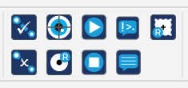

# EyeLink Plugin for OpenSesame 4
**Version 2.2, May 2026**

---

The EyeLink plugin for OpenSesame 4 helps you control and communicate with EyeLink eye trackers. Install (section 1) or update (section 7.2) to the latest release of the plugin, and download the most recent example scripts that use an SR Research recommended implementation.

## License
Modify the source code to meet your experimental needs.

**Eyelink Plugin for OpenSesame 4**
(packages: opensesame-plugin-eyelink, opensesame-eyelink-coregraphics, sr-research-pylink)

© 2026 SR Research

This program is free software; you can redistribute it and / or modify it under the terms of the GNU General Public License as published by the Free Software Foundation; either version 3 of the License, or (at your option) any later version. This program is distributed in the hope that it will be useful, but WITHOUT ANY WARRANTY; without even the implied warranty of MERCHANTABILITY or FITNESS FOR A PARTICULAR PURPOSE. See the GNU General Public License for more details. You should have received a copy of the GNU General Public License along with this program; if not, write to the Free Software Foundation, Inc., 51 Franklin Street, Fifth Floor, Boston, MA 02110-1301, USA.

---

## 1. Installation
This plugin has been tested on Windows 11, Ubuntu 24, and macOS 26, but should work for all operating systems supported by OpenSesame 4.0:

1. Launch OpenSesame v4.0 (and above).
2. In the console type the following pip installation command and press Enter, wait for a success message.
```
   pip install opensesame-plugin-eyelink
```
3. Close OpenSesame and then open it again, the EyeLink Plugins should now be visible in the Toolbar Items menu under the header EyeLink.



> **Important:** For offline installation steps see section **7.1 Offline Installation.**
---

## 2. Using the Plugin
To use the plugin, simply drag the relevant EyeLink items to the required location in the experiment sequence. For general cognitive tasks, we recommend that users follow these integration steps:

### Experiment level
To connect to your EyeLink when the script initializes, add `el_connect` at the top level of the project. This will initialize the connection to the EyeLink and open an EyeLink Data File (EDF) on the Host PC.

Calibrate the tracker at the beginning of each session by adding `el_camera_setup` directly after `el_connect`. Use the `el_camera_setup` item to transfer the camera image to the experimental PC, adjust the pupil/CR thresholds, and calibrate and validate the tracker

At the end of the task (after the block / trial loop), the project will require `el_disconnect` to disconnect from the Eyelink Host PC and transfer the EDF to the experimental PC.

### Trial level
Add `el_drift_check` on each trial before starting to record. The `el_drift_check` will check gaze accuracy by presenting a single calibration target for experimenter confirmation, this allows you to re-calibrate the tracker if required (press ESC on the Host PC, then C to calibrate / V to validate, Enter to accept and then O to return to the script).

Start recording by adding `el_start_recording` and at the end of each trial, and stop the recording with `el_stop_recording`. This start / stop approach divides the EDF session into trials and will reduce the size of the EDF data file. For EEG and other tasks where continuous recording is preferred, please start recording at the beginning of each run / session.

The `el_start_recording` item has the option to send a “recording status” message to the tracker (for example: ‘Trial 1’); this message will be shown in the bottom-right corner of the Host PC screen during recording. You can also specify a Sketchpad from the project to send to the Host PC as a reference image, on which gaze will be overlaid during recording.

To simplify later analysis, we strongly recommend using `el_send_message` to send messages to the EDF to store trial variables, responses, areas of interest, and key stimulus onset/offset times. These messages are very important for isolating critical time periods, screen regions and trial types when producing reports of eye movement data. Without these messages you will not be able to determine what occurred when and where during each trial.

Find three example OpenSesame projects demonstrating the recommended integrations on the SR Research Support Fourm: [Getting Started with OpenSesame](https://www.sr-research.com/support/thread-52.html).

---
<div style="page-break-after: always;"></div>

## 3. Plugin Items Description
 
###  el_connect 
  Establishes a link to the EyeLink, configures the tracker, and automatically opens an EyeLink Data File on the Host PC to record eye movement data.

| Option | Description |
| :--- | :--- |
| **Dummy Mode** | Run the tracker in a simulation mode, where no physical connection to the tracker is established and the EyeLink items are skipped. This is useful for testing projects when not connected to the EyeLink. |
| **Use Custom IP Address** | The default IP address of the EyeLink Host PC is 100.1.1.1, in certain circumstances the Host IP may need to be changed. This option can be checked to enable the default Tracker to be edited / changed to a different value in the Tracker Address option. |
| **Disable Calibration Sound** | An option to disable calibration, validation, and drift check tones. |
| **Tracker Address** | If the Host IP needs to be changed, check the Use Custom IP Address option to enable editing of this IP address to match the Host. |

###  el_disconnect
This item closes the connection with the EyeLink Host PC and retrieves the EDF data file over the link. Add this item at the end of the experiment level in the project. The transferred EDF file can be found within the results directory, inside a sub-folder named for the session, e.g. results/150/150.edf. There are no options to configure for this item.

###  el_camera_setup
This item configures the EyeLink and allows the operator to calibrate the eye tracker. Add this item at the experiment level after `el_connect`. 

| Option | Description |
| :--- | :--- |
| **Calibration Type** | Select the calibration type, i.e, HV9 for a 9-point calibration. |
| **Randomize Order** | Randomize the order of the calibration / validation targets |
| **Repeat First Point** | Repeat the first point. This option is enabled by default, and helps to improve calibration results. |
| **Force Manual Accept** | Manually accept fixation duration calibration / validation by pressing SPACEBAR or ENTER. One can switch to automatic mode at any time during calibration / validation by pressing “A” on the Host or experimental PC keyboard. |
| **Calibration Target** | Select which type of calibration target to use. The default is a bull’s eye shaped dot. You can also use an image or a video as the calibration target by selecting either option. |
| **Custom Target Image/Video** | Select an image or video file from the File Pool to use as the calibration target based on the calibration target option selected. |

###  el_drift_check
This item performs a drift check of the tracker and facilitates a return to camera setup to recalibrate if necessary (by pressing Esc on the Host PC). Include a drift check before each trial’s `el_start_recording`. 

| Option | Description |
| :--- | :--- |
| **Target X / Y** | The coordinates of the drift check target in OpenSesame screen coordinates (i.e., 0,0 correspond to the center of the screen). The drift check target does not necessarily need to be presented at the center of the screen. |
| **Drift Check Target** | Either the same target type as the prior el_camera_setup (default), or an image specified from the File Pool |
| **Custom Target Image** | Select an image file from the File Pool to use as a target. |

###  el_start_recording
This item starts recording gaze data. It is best placed at the beginning of each trial. 

| Option | Description |
| :--- | :--- |
| **Eye Events Available Over Link** | Allows accessing event data over the link during recording. |
| **Samples Available Over Link** | Allows accessing sample data over the link during recording. |
| **Recording Status Message** | Send a message to the Host PC screen to show the current trial number, condition, etc. |
| **Sketchpad to draw on the Host PC** | Enter the name of the sketchpad you want to draw as a reference image on the Host PC (leave blank for none). |

###  el_stop_recording
This item stops recording gaze data and logs any specified variables to the EDF data file. OpenSesame does not log user-defined variables by default; use an inline script to log these variables in the EDF data file.

| Option | Description |
| :--- | :--- |
| **Log all experiment variables...** | You can either manually specify the variables to store to the EDF file or choose to log all variables to the EDF. The recommended approach would be to include only those variables required for analysis to save time and reduce file size. |

###  el_send_command
Send commands to the tracker. Certain Host PC functions can be altered by sending the appropriate commands. If you need to send multiple commands, put each command in a new line*.

sampling_rate 500

The various 'draw' commands can be very useful and can be used to draw simple landmarks on the Host display during recording. These commands (e.g., clear_screen, draw_line, draw_box, draw_text) can be found in the COMMANDS.INI file on the Host PC, under `/elcl/exe`.

Various commands can be used to configure certain EyeLink tracker options, for example, setting the sampling rate to 500 Hz.
*\* This node is not as flexible as inline scripts; please see the OpenSesame projects accompanying the plugin for example code.*

###  el_send_message
Messages are very important and we need messages in the EyeLink Data File to know what events happened during a trial and at what time. Messages should be sent to the tracker every time a stimulus screen is shown and when a response is made. Multiple messages can be sent in a single item*, simply put one message per line.

keyboard_resp

Data Viewer Integration Messages can also be written to the EDF file. These messages will be used to load interest areas, background images / videos, and simple drawing commands. Please see the Data Viewer User Manual for a full list of Data Viewer integration messages (Section 8: Protocol for EyeLink Data to Viewer Integration).
*\* This node is not as flexible as inline scripts; please see the OpenSesame projects accompanying the plugin for example code.*

###  el_gaze_trigger
The gaze trigger item uses the real-time gaze data from the EyeLink to control later actions in the project. For example, it can be used to ensure that the critical stimuli is not shown until gaze is detected within a small region surrounding a fixation point for at least 500ms.

| Option | Description |
| :--- | :--- |
| **Trigger Location (x,y)** | The x and y pixel coordinates for the trigger in OpenSesame pixel location (0,0 is screen centre). |
| **Trigger Size (pixels)** | The width / height of the square around the trigger location in pixels. |
| **Fire Within** | This trigger will fire when gaze is detected within the above defined region (checked) or outside of it (unchecked) for the minimum duration. |
| **Minimum Duration (ms)** | The minimum period of sequential gaze samples that must be held within / without the trigger region in milliseconds. In dummy-mode (without a connection to the tracker) the trigger will fire at this value automatically. |
| **Allow Skip (x key)** | If checked, pressing the x key will skip this trigger, for example, if gaze is not firing the trigger this key will allow the project to move on. If aborted, a trial variable ‘Gaze_Trigger_Aborted’ is written to the EDF as True, if the gaze trigger fires it is written with False. |
| **Create Interest Area...** | An option (when checked) to automatically create an interest area for the defined trigger region in Data Viewer. |

---

## 4. Additional Tips and Advanced Integration

### 4.1 Referring to EyeLink from inline scripts
The EyeLink instance initialized by the plugin can be accessed from OpenSesame inline scripts by referencing `exp.eyelink`.

For example, putting the following command in an inline script will clear the screen of the Host PC

exp.eyelink.sendCommand('clear_screen 1')

For all the attributes and methods of the EyeLink instance, please refer to the PyLink API User Guide for details. The PyLink API User Guide is packaged within the EyeLink Developers Kit and can be accessed from:
* **Windows**: Start Menu -> All Programs -> SR Research-> Manuals
* **macOS**: `/Applications/Eyelink/SampleExperiments/Python/`
* **Linux**: `/usr/share/EyeLink/SampleExperiments/Python/`

### 4.2 Interest Area definitions
Data Viewer software requires specifying the Interest Area in a top-left coordinate space (where 0,0 is the top-left corner of the screen). In OpenSesame, the origin of the default screen coordinates is the center of the screen instead. Some math is required when creating interest area messages to convert between the two coordinate spaces.

This feature is illustrated in the “Visual World Task” example. We have four images, so we use a for-loop to figure out the position of each image, then we send the interest area definition messages to the tracker.

for i in range(4):
    im_x, im_y = pos[pos_index[i]]  # image position x, y
    
    # interest area index (starts from 1)
    ia_index = i + 1
    
    # interest area img_label
    ia_label = img_labels[i]
    
    # image position in the typical coordinates in computer graphics
    ia_left = int(im_x - img_w/2 + var.width/2) 
    ia_top = int(im_y - img_h/2 + var.height/2)
    ia_right = int(im_x + img_w/2 + var.width/2)
    ia_bottom = int(im_y + img_h/2 + var.height/2)
    
    # for precise timing, include a time offset in the Interest area message 
    msg_offset = int(self.clock.time() - self.var.time_stimulus_display)
    
    # construct and send the Interest Area messages     
    ia_msg_pars = (msg_offset, ia_index, ia_left, ia_top, ia_right, ia_bottom, ia_label)
    ia_msg = '%d !V IAREA RECTANGLE %d %d %d %d %d %s' % ia_msg_pars
    exp.eyelink.sendMessage(ia_msg)

---

## 5. The picture example
This is a simple passive viewing task. We show an image on the screen; the participant presses a key to see the next image. The structure of the task is fairly simple: we connect to the EyeLink, calibrate, perform a drift check, transfer the stimulus display to the Host PC, record eye movements while viewing each image, then disconnect from the tracker.

In each trial, we then perform drift-check, send the backdrop image to the Host, start recording, show the image, wait for a keyboard response, then record the variables to the EDF file and stop recording.

### 5.2 Showing background image in Data Viewer
Data Viewer is a powerful data analysis and visualization tool. When examining gaze data it is often helpful to have the data displayed over a background image - in order to create visualizations such as heatmaps.

To allow Data Viewer to identify the appropriate background image of each trial, you need to send an `!V IMGLOAD` message to the tracker. The format of the `!V IMGLOAD` message can be found in the Data Viewer user manual. In the example below we provided a `CENTER` command, to instruct Data Viewer to draw the image in the screen center during visualization.
```
### We need a time offset to proper use a message to mark the onset of the stimulus_display screen
time_offset = int(self.time() - var.time_stimulus_display)
exp.eyelink.sendMessage('%d stimulus_display' % time_offset)

### Send another message to let Data Viewer know where to load the background image during
### visualization; this require a special "!V IMGLOAD CENTER" message
img_path = '../../images/' + var.image
img_x = var.width/2
img_y = var.height/2
imgload_msg = '%d !V IMGLOAD CENTER %s %d %d'%(time_offset, img_path, img_x, img_y)
exp.eyelink.sendMessage(imgload_msg)
```
There are two additional things of note:
It is possible to add a time offset to a message so the timestamp of the messages marks the actual trial time of the event. For instance, if you have a picture that will be presented for 1-sec, sending the message before the image sketchpad may give you a screen refresh error. Instead, you can send the message following the image presentation, by including a time offset (like shown below) in the message.
```
# We need a time offset to accurately mark the onset of the stimulus_display screen
time_offset = int(self.clock.time() - var.time_stimulus_display)
exp.eyelink.sendMessage('%d stimulus_display' % time_offset)
```
The EDF data files themselves do not contain any background images. Instead, the EDF files store a reference path to the image file location, so Data Viewer can find the images when loading the EDF data files. Note that the “path” to the image file is relative to where you store your EDF data file.
```
# Send another message to let Data Viewer know where to load the background image during visualization; this require a special "!V IMG
img_path = '../../images/' + var.image
img_x = var.width/2
img_y = var.height/2
imgload_msg = '%d !V IMGLOAD CENTER %s %d %d'%(time_offset, img_path, img_x, img_y)
exp.eyelink.sendMessage(imgload_msg)
```
---

## 6. Visual World example
This example script shows how to program a basic Visual World type task in OpenSesame. OpenSesame can require a significant amount of “inline” scripting for tasks of medium to high complexity. The scripting elements are discussed in more detail below.

### 6.1 Overview of the task
The task is relatively straightforward. A drift check target (cross) first appears on the screen, then 4 image objects appear. After a preview period of 1000 msec, an audio file starts to play. The participant’s task is to quickly move the mouse cursor to click the target object (grapes in the present task) when they hear the target word (grapes).

This task requires precise timing for audio playback. Please bear in mind that SR Research has not verified the timing of OpenSesame and we encourage users to perform their own tests if stimulus timing is critical for their tasks.

The overall organization of the script is not complicated - for introductory tutorials on programming in OpenSesame please check the Tutorial section on the OpenSesame website, [http://osdoc.cogsci.nl](http://osdoc.cogsci.nl).

### 6.2 Interest Areas and Host PC landmarks
The Visual World task uses inline scripts, for example the “sti_preparation” inline item. Here we first create a list of four screen locations with the `xy_circle()` function. Then, we change the position of the objects based on the location specified in the “block” loop. The “location” of each object is specified in the block loop as integers, i.e., 1, 2, 3, 4. We use this variable as an index to set the position of each object by using the list of screen coordinates (`sti_pos`) we created with `xy_circle()`.
```
# the positions of the objects
pos = xy_circle(n=4, rho = 250)

# get the canvas on which the objects are shown
sti = items['stimulus_display'].canvas

# Clear the screen in Data Viewer
exp.eyelink.sendMessage('!V CLEAR_SCREEN 128 128 128')

# width and height of the images we use
img_w, img_h =[240, 240]

# position the images (tar, dis_1, dis_2, dis_3)
pos_index = [var.target_loc-1, var.distractor_1_loc-1, var.distractor_2_loc-1, var.distractor_3_loc-1]

# image labels on the sketchpad
img_labels = ['tar', 'dis_1', 'dis_2', 'dis_3']

# name of the files 
img_files = [var.target_img, var.distractor_1_img, var.distractor_2_img, var.distractor_3_img] 

for i in range(4):
    s = img_labels[i]
    
    # set image position on the canvas
    sti[s].x, sti[s].y = pos[pos_index[i]]
    
    # image position in the typical coordinates in computer graphics
    ia_left = int(sti[s].x - img_w/2 + var.width/2) 
    ia_top = int(sti[s].y - img_h/2 + var.height/2)
    ia_right = int(sti[s].x + img_w/2 + var.width/2)
    ia_bottom = int(sti[s].y + img_h/2 + var.height/2)
    
    # send Interest Area messages, IA labels should start with 1
    ia_msg = '!V IAREA RECTANGLE %d %d %d %d %d %s' %(i+1, ia_left, ia_top, ia_right, ia_bottom, s)
    exp.eyelink.sendMessage(ia_msg)
    
    # IMGload commands for drawing pictures in Data viewer
    img_path = '../images/' + img_files[i]
    img_x = sti[s].x+var.width/2
    img_y = sti[s].y+var.height/2
    imgload_msg = '!V IMGLOAD CENTER %s %d %d'%(img_path, img_x, img_y)
    exp.eyelink.sendMessage(imgload_msg)
```
In a for-loop, we send interest area messages to the tracker and record messages that will be used by Data Viewer to load the relevant background images for each trial. Transformation of the coordinates is needed to convert from OpenSesame’s centre coordinates to EyeLink’s top-left coordinates. In the for-loop, we first get the left, top, right, and bottom of each of the images. Then, use this information to construct interest area messages, and also the landmark drawing commands. The interest areas are all rectangular, for other types of Interest Areas, please see the Data Viewer User Manual. With these messages, the Interest area definitions will be automatically loaded into Data Viewer when an EDF data file is opened.

### 6.3 Message to mark trial events
In the “MSG_target_word” inline script, we wait until the target word is played in the audio file. Then we send a message to the tracker to mark the onset of the target word (“grapes”). This message is critical for effective analysis, as without this message, it would be challenging to align the eye movement data to the onset of the target word.
```
# wait for the onset of the target word, then should the mouse cursor
clock.sleep(var.target_word_onset_time)
# send a message to let the tracker know the onset of the target word
exp.eyelink.sendMessage('target_word_onset')
```
### 6.4 Trial variables
At the end of each trial, in el_stop_recording, specified variables in the OpenSesame namespace are recorded to the EDF data file. These variables are critical for group-level analysis in Data Viewer and can be accessed from the Trial Variable Value Editor within Data Viewer.

## 7. Offline Installation and Support

### 7.1 Offline Installation
If your Display PC is not connected to the internet (which is common for dedicated experimental setups), you can still install the required dependencies using an offline method. 

> **Important:** The `sr-research-pylink` package is Python-version specific. If the internet-connected computer you are using to download the packages does not have the exact same version of Python and operating system as your offline Display PC, you must explicitly tell `pip` which versions to target.

**Step 1: Download the packages on an internet-connected computer**

*Standard Download (If both PCs have the exact same Python version and OS):*
Open a terminal or command prompt on a machine with internet access and run:
`pip download --no-deps sr-research-pylink opensesame-eyelink-coregraphics opensesame-plugin-eyelink -d ./eyelink_packages`

*Targeted Download (If the PCs have different Python versions or OS):*
Force `pip` to download specific pre-compiled .whl files (wheels) for the target Display PC. Use the `--only-binary=:all:` flag to fetch only .whl files (ignoring source distributions) and the `--no-deps` flag to download only the specified packages. Include the specific `--python-version`, `--platform`, and `--abi` of the offline machine.

To determine your `--abi` and `--platform` tags:
* **`--abi`:** For standard Python installations, this is simply `cp` followed by the Python version without the dot. For example, Python 3.9 is `cp39`, Python 3.10 is `cp310`, and Python 3.11 is `cp311`.
* **`--platform`:** Common platform tags include `win_amd64` (64-bit Windows), `macosx_10_9_x86_64` (Intel macOS), `macosx_11_0_arm64` (Apple Silicon macOS), or `manylinux2014_x86_64` (Linux).

For example, to download the packages for a Display PC running **64-bit Windows** and **Python 3.13**, run the following command:
`pip download --only-binary=:all: --python-version 3.13 --platform win_amd64 --abi cp313 --no-deps sr-research-pylink opensesame-eyelink-coregraphics opensesame-plugin-eyelink -d ./eyelink_packages`

**Step 2: Transfer the files**
Move the `eyelink_packages` folder to your offline Display PC using a USB drive.

**Step 3: Install the packages on the Display PC**
Open OpenSesame on your offline Display PC, navigate to the location where you saved the `eyelink_packages` folder, and run the following command to install the packages directly from the local files:
`pip install --no-index --find-links=./eyelink_packages pygame sr-research-pylink pygame-eyelink-coregraphics`

### 7.2 Technical Support
A good first troubleshooting step is to check if you have the latest versions of both of the plugin and its core dependencies.

In the Console of OpenSesame paste the following command and press Enter:

`pip install sr-research-pylink opensesame-eyelink-coregraphics opensesame-plugin-eyelink --upgrade`

Once completed, please close and reopen OpenSesame to see and use the updates.

If you encounter any issues running the provided example scripts, or if you need assistance integrating EyeLink tracking into your own OpenSesame experiments, please do not hesitate to reach out to our support team. 

You can contact us directly at [support@sr-research.com](mailto:support@sr-research.com). 

To help us resolve your issue as quickly as possible, please include the following information in your email:
* Your EyeLink model and Host PC software version.
* The Operating System of your Display PC (e.g., Windows 11, macOS 26, Ubuntu 22.04).
* The version of Python and OpenSesame you are using.
* A brief description of the issue, including any specific error messages or the name of the example script you are trying to run.

## 8. Known issues and limitations
The EyeLink plugin is under development. Note the following known issues:

* **macOS Sequoia and higher:** These operating systems require all apps to request and receive local network permissions to connect to networked devices. OpenSesame does not currently request this permission and cannot connect to the EyeLink. Bypass this by launching OpenSesame in the terminal with the following command:
```
/Applications/OpenSesame.app/Contents/Resources/bin/python /Applications/OpenSesame.app/Contents/Resources/bin/opensesame 
```
* **macOS and Linux with PsychoPy Backend:** If the default PsychoPy backend fails on macOS or Linux, switch to the more reliable Pygame backend.
